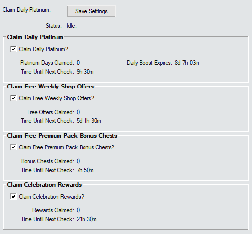

# Claim Daily Platinum Addon

This is a very simple AddOn that can claim your free daily Platinum automagically so you don't have to.  
It can also claim:
- Trials rewards
- Free weekly shop offers
- Bonus chests from premium packs on sale that you've already bought
- Celebration rewards

___

___

## Claim Daily Platinum

The first section of the addon determines whether the script will try to claim the daily Platinum.

The timer for it is initialised to check 1 minute after starting the Gem Farm script - and it will check again whenever the server says it will be ready (+30 seconds for safety).

This section contains the status of Daily Boost. If you do not have Daily Boost it will say `Inactive`. If you do - it will tell you how long until it expires.

This setting is on by default.

> [!IMPORTANT]
> *If the addon has already claimed the daily platinum - and then you purchase the Daily Boost - you will need to claim the boost for that day manually. The addon will be able to claim the boost for all future days.*

___

## Claim Trials Rewards

The second section of the addon determines whether the script will try to claim the rewards from Trials of Mount Tiamat.

The timer for it is initialised to check 2 minutes after starting the Gem Farm script. After that it gets complicated.
- If the Trial is not running or is in the lobby then it will check every 8 hours.
- If the Trial is running it will calculate how long before Tiamat dies based on her current HP and total DPS and check again after half of that much time or 8 hours (whichever is shorter).

This is all to try to make sure it will claim the reward at most a couple of minutes after the Trial ends - and that it can cope with DPS changes as players do more damage and complete their daily goals.

This section contains the status of the current Trial.

This setting is on by default.

> [!NOTE]
> If the status says `Tiamat Dies in:` then that time is *estimated* based on Tiamat's health and the total DPS when the previous check happened. Depending on how long ago that check was - the time could be very inaccurate.

___

## Claim Free Weekly Shop Offers

The third section determines whether the script will try to claim any free weekly shop offers.

The timer for it is initialised to check 3 minutes after starting the Gem Farm script - and it will check again whenever the server says it will be ready (+30 seconds for safety).

This setting is on by default.

___

## Claim Free Premium Pack Bonus Chests

The fourth option will try to claim the bonus chests available when a premium pack that you've already bought goes on sale.

The timer for it is initialised to check 4 minutes after starting the Gem Farm Script - and it will check again every 8 hours.

This setting is on by default.

___

## Claim Celebration Rewards

The fifth option will try to claim rewards available during a Celebration event such as the seasonal celebrations - where you get one chest per day and an extra special one if you claim at least four days.

The timer for it is initialised to check 5 minutes after starting the Gem Farm Script. If the addon can see there is a celebration running and can pull a timer from it - it will check when the next day will be claimable. Otherwise it checks every 8 hours.

This setting is on by default.