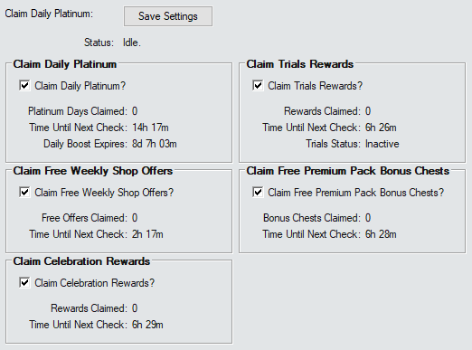

# Claim Daily Platinum Addon

This is a very simple AddOn that can claim your free daily Platinum automagically so you don't have to. It can also claim free weekly shop offers and bonus chests from premium packs on sale that you've already bought.

___

___

## Claim Daily Platinum

The first section of the addon determines whether the script will try to claim the daily Platinum.

The timer for it is initialised to check 1 minute after starting the Gem Farm script - and it will check again whenever the server says it will be ready (+30 seconds for safety).

This setting is on by default.

> [!IMPORTANT]
> *If the addon has already claimed the daily platinum - and then you purchase the Daily Boost - you will need to claim the boost for that day manually. The addon will be able to claim the boost for all future days.*

___

## Claim Free Weekly Shop Offers

The second section determines whether the script will try to claim any free weekly shop offers.

The timer for it is initialised to check 2 minutes after starting the Gem Farm script - and it will check again whenever the server says it will be ready (+30 seconds for safety).

This setting is off by default because some people may occasionally wish to reroll their offers.

___

## Claim Free Premium Pack Bonus Chests

The third option will try to claim the bonus chests available when a premium pack that you've already bought goes on sale.

The timer for it is initialised to check 3 minutes after starting the Gem Farm Script - and it will check again every 8 hours.

This setting is on by default.